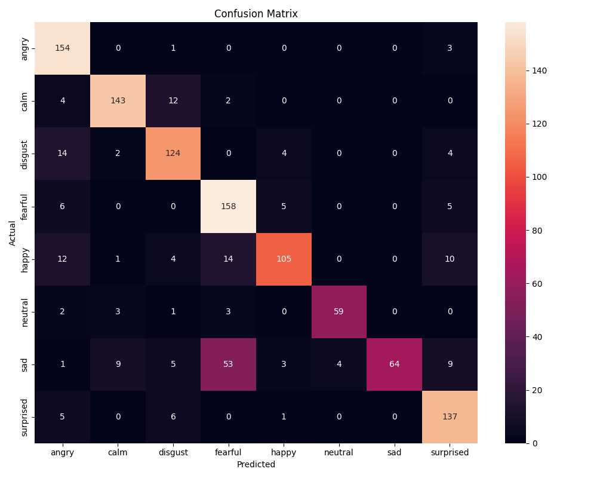

# SentimentSound

## Overview
This is a deep learning model for Speech Emotion Recognition that can classify audio clips into different emotional states. The model is trained on a dataset of speech samples and can identify emotions such as neutral, calm, happy, sad, angry, fearful, disgust, and surprised.

## Model Details
- **Model Type:** Hybrid Neural Network (CNN + LSTM)
- **Input:** Audio features extracted from 3-second wav files
- **Output:** Emotion classification

### Supported Emotions
- Neutral
- Calm
- Happy
- Sad
- Angry
- Fearful
- Disgust
- Surprised

## Installation

### Clone the Repository
```bash
git clone https://github.com/Vishal-Padia/SentimentSound.git
```

### Dependencies
```bash
pip install -r requirements.txt
```

### Usage Example

```bash
python emotion_predictor.py
```


## Model Performance
- **Accuracy:** 85%
- **Evaluation Metrics:** Confusion matrix below



## Training Details
- **Feature Extraction:** 
  - MFCC
  - Spectral Centroid
  - Chroma Features
  - Spectral Contrast
  - Zero Crossing Rate
  - Spectral Rolloff
- **Augmentation:** Random noise and scaling applied
- **Training Techniques:**
  - Class weighted loss
  - AdamW optimizer
  - Learning rate scheduling
  - Gradient clipping

## Limitations
- Works best with clear speech recordings
- Optimized for 3-second audio clips
- Performance may vary with different audio sources

## Acknowledgments
- Dataset used for training (https://www.kaggle.com/datasets/uwrfkaggler/ravdess-emotional-speech-audio)